###  Hi! I'm May

I'm a Computer Science student specializing in **Artificial Intelligence**, with interests in **software development, UI/UX design, and cloud technologies**. I enjoy building meaningful and creative applications that turn ideas into practical solutions.

I value collaboration and enjoy working with people who share the same passion for **innovation, positivity, and continuous growth**. I believe great technology is built through continuous learning, creativity, and teamwork.

## Contributions

  

